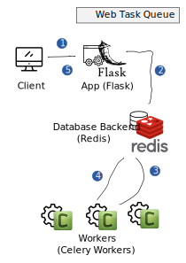
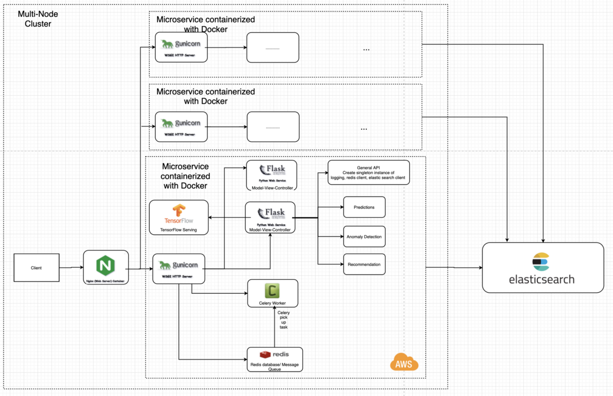

## How to Run Tests and Use
async REST service using for image resizing
To build and start the project, from the project root:
```bash
cd path/to/dir
$ docker-compose up

Local build

$ docker build -t image_resize:latest . # build the Docker image from the Dockerfile
$ docker-compose up -d # start the worker, redis, and api containers in the background
$ docker-compose logs -f # tail the logs
```

## API Reference:

### Create resize task:
```http request
POST /api/v1/images/resize HTTP/1.1

Content-Type: multipart/form-data
height=100
width=100

Example of 
curl -X POST \
  http://localhost/api/v1/images/resize \
  -H 'cache-control: no-cache' \
  -H 'content-type: multipart/form-data; boundary=----WebKitFormBoundary7MA4YWxkTrZu0gW' \
  -H 'postman-token: 82173c2e-9d05-57f0-5e75-497270ae214d' \
  -F 'file=@Screen Shot 2021-04-02 at 18.20.50.png' \
  -F height=100 \
  -F width=100

```
Accepts a file in `mulipart/form-data` format and json with height and width 
parameters
Returns a json with created task id, or error

### Get task state
```http request
GET /api/v1/status/<uuid:task_id> HTTP/1.1
e.g.
curl -X GET http://localhost/api/v1/status/c4ac4a34-40a2-4750-a158-767c2c68164d
```
Accepts a task id in UUID format as a GET parameter, and returns state of that 
task, or returns 404 if there is not task with given id

### Get task result
```http request
GET /api/v1/images/result/<uuid:task_id> HTTP/1.1

curl -X GET http://localhost/api/v1/images/result/c4ac4a34-40a2-4750-a158-767c2c68164d
```


Accepts a task id in UUID format as a GET parameter, and returns result of that 
task, or returns 404 if there is not task with given id or it's not completed
yet

## Testing
Before running the tests please install the following dependencies in your local environment or you may also activate a fresh virtual environment.
- `pip install -r requirements.txt`
- `pip install pytest`
>Provides `nosetests` command to discover and run tests.

Run the tests using: `python -m unittest tests/*`
> Please make sure as to start the server using `docker-compose up` before running them.

> One of the three tests may fail only the first time after starting the server due to some latency from redis.(if THP support is enabled in your kernel.)

## Structure
The repo has the following structure:
- `image-resize/`
  - `app/views.py` defines the endpoints
  - `app/tasks.py` defines Celery tasks
- `tests/`
  - `tests/*.py` contains all the tests for the apis
- `app.py` is the entry point for starting the Flask app server
- `tasks.py` is the entry point for the Celery worker
- `requirements.txt` is the list of python dependencies for pip
- `docker-compose.yml` all the service containers
- `Dockerfile` is the image for the app & celery worker

#### Dependencies
 - `flask` - micro web application framework, makes getting started quick and easy. Using the inbuilt server too.
 - `pillow` - python imaging library, used for resizing the image
 - `celery` - distributed task queue used for asynchronous task processing
 - `redis` - used as a message broker as well as the result backend for celery to communicate with the flask server.
-  `mock` - used to inject/mock testing configuration while instantiating the app.

## Architecture/Flow



- To implement the long-running tasks in application's work flow to resize images we should handle these tasks in the background, outside the basic application flow as a separate worker process.
- As an image is sent via a request to our flask server, it passes the task of resizing off to a task queue and immediately sends back a `token` i.e same as the `task-id` as a response back to the client.
- Flask server connects to the Redis message broker and the message broker talks to the Celery worker.Celery communicates via messages, usually using a broker to mediate between clients and workers. 
- Celery worker then identifies the methods decorated with `@celery.task` and runs them asynchronously updating the status of tasks to redis container also used as a result backend.




## Potential Improvements
To keep this project small in scope, there are a few technical decisions I made wouldn't scale if we wanted to release this service in production. Some of the areas that are worth revisiting are:
- We should consider adding API authentication, rate limiting, and throttling to prevent bad actors from abusing the system.
- Once we reach a certain volume of API requests, a single API server won't be able to handle the load. At that point, it may be worthwhile to scale the API server horizontally and potentially add a load balancer in front to distribute the load evenly.
- Depending on any SLAs that our service has committed to, we'll need to add metrics monitoring (e.g. Datadaog) so we can track various metrics (e.g. p99 time to generate a thumbnail) and be alerted if there is slowdown or our service is breaking our SLA.
- Validation and error handling. Currently, very little is being done so and a malicious actor could submit a URL to a very large file and cause the workers to crash.
- Depending on our needs for strong consistency or high availability, we'd most likely want to replace our Redis key-value store with something less transient and more durable.
- Depending on our read/write ratio of API requests, once we reach a certain scale where our database is hitting its limits, it may be fruitful to shard our database. For example, if our read/write ratio if 80/20, we may want to have a handful of read-only DBs and a single DB that allows writes.
- We currently store all resized image indefinitely in a folder that's shared between the workers and the API server. It would be worthwhile to look at storing the resized image somewhere else (e.g. Amazon S3, Google Cloud Storage) and maybe adding some sort of expiry on each thumbnail (e.g. 30 days).
- In the current implementation, a single queue is used. If we want to offer multiple priority levels, or perhaps offer high-priority for single requests and low-priority for batch requests, it would make sense to use multiple queues. We would also be able to scale up the workers per queue.
- The testing added to this project was definitely on the light side. Currently, the worker logic and API server are a bit tightly coupled, and it would be worthwhile to separate the two further out to make adding individual unit tests easier. Furthermore, there's opportunity to do integration testing (e.g. build a staging environment to test the thumbnail generation pipeline) and system testing (e.g. stress testing, performance testing, load testing) before releasing the service.


#### Infra
- Although Flask has a built-in web server, it’s not suitable for production and needs to be put behind a real web server able to communicate with Flask through a WSGI protocol. A common choice for that is Gunicorn— a Python WSGI HTTP server.
- While being an HTTP web server, Gunicorn, is not suited to face the web. That’s why we need Nginx as a reverse proxy and to serve static files. In case we need to scale up our application to multiple servers, Nginx will take care of load balancing as well.
- Also need to enable SSL module for nginx to configure HTTPS.
- Currently, the resized images are created in a shared docker volume, assigned while creating the services. In a real-life application scenario, we'd require to upload these images to a object storage service(example- S3, Google cloud storage) and access them via a CDN. 

#### Other
- Monitoring of celery workers is also not implemented, for which we could use [Flower](https://flower.readthedocs.io/en/latest/). Flower also supports basic HTTP auth, oAuth and can also be used to manage the worker pool size and auto scale settings.
- The current application lacks continuous integration and continuous deployment.
